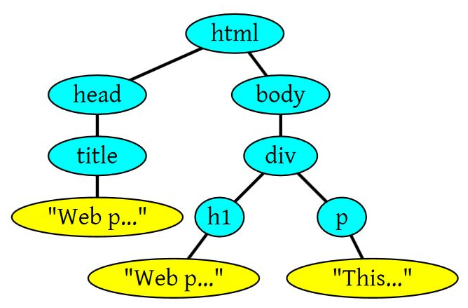

# CSS知识总结
## 浏览器渲染原理
### 构建DOM树

浏览器会遵守一套步骤将HTML 文件转换为 DOM 树。

    <html>
    <head>
        <title>Web page parsing</title>
    </head>
        <body>
        

            <h1>Web page parsing</h1>
            
This is an example Web page.

        

    </body>
    </html>
上面这段HTML会解析成这样：

### 构建CSSOM
DOM会捕获页面的内容，但浏览器还需要知道页面如何展示，所以需要构建CSSOM。

注意：CSS匹配HTML元素是一个相当复杂和有性能问题的事情。所以，DOM树要小，CSS尽量用id和class，千万不要过渡层叠下去。

### 构建渲染树
生成 DOM 树和 CSSOM 树以后，就需要将这两棵树组合为渲染树。
渲染树只会包括需要显示的节点和这些节点的样式信息，如果某个节点是 display: none 的，那么就不会在渲染树中显示。

* 当浏览器生成渲染树以后，就会根据渲染树来进行布局（也可以叫做回流）。这一阶段浏览器要做的事情是要弄清楚各个节点在页面中的确切位置和大小。通常这一行为也被称为“自动重排”。

* 布局流程的输出是一个“盒模型”，它会精确地捕获每个元素在视口内的确切位置和尺寸，所有相对测量值都将转换为屏幕上的绝对像素。

* 布局完成后，浏览器会立即发出“Paint Setup”和“Paint”事件，将渲染树转换成屏幕上的像素。

常见问题

1. JavaScript的加载、解析与执行会阻塞DOM的构建，也就是说，在构建DOM时，HTML解析器若遇到了JavaScript，那么它会暂停构建DOM，将控制权移交给JavaScript引擎，等JavaScript引擎运行完毕，浏览器再从中断的地方恢复DOM构建。
2. JavaScript不只是可以改DOM，它还可以更改样式，也就是它可以更改CSSOM。前面我们介绍，不完整的CSSOM是无法使用的，但JavaScript中想访问CSSOM并更改它，那么在执行JavaScript时，必须要能拿到完整的CSSOM。所以就导致了一个现象，如果浏览器尚未完成CSSOM的下载和构建，而我们却想在此时运行脚本，那么浏览器将延迟脚本执行和DOM构建，直至其完成CSSOM的下载和构建。也就是说，在这种情况下，浏览器会先下载和构建CSSOM，然后再执行JavaScript，最后在继续构建DOM。

引起回流方法和属性
* 添加或者删除可见的DOM元素；
* 元素尺寸改变——边距、填充、边框、宽度和高度
* 内容变化，比如用户在input框中输入文字
* 浏览器窗口尺寸改变——resize事件发生时
* 计算 offsetWidth 和 offsetHeight 属性
* 设置 style 属性的值
  

引起重绘属性

减少回流和重绘
* 使用 transform 替代 top
* 使用 visibility 替换 display: none ，因为前者只会引起重绘，后者会引发回流（改变了布局）
* 不要把节点的属性值放在一个循环里当成循环里的变量。
* 不要使用 table 布局，可能很小的一个小改动会造成整个 table 的重新布局
* 动画实现的速度的选择，动画速度越快，回流次数越多，也可以选择使用 requestAnimationFrame
* CSS 选择符从右往左匹配查找，避免节点层级过多
* 将频繁重绘或者回流的节点设置为图层，图层能够阻止该节点的渲染行为影响别的节点。比如对于 video 标签来说，浏览器会自动将该节点变为图层。

### async和defer的作用和区别

1. 没有 defer 或 async，浏览器会立即加载并执行指定的脚本，也就是说不等待后续载入的文档元素，读到就加载并执行。
2. defer 属性表示延迟执行引入的 JavaScript，即这段 JavaScript 加载时 HTML 并未停止解析，这两个过程是并行的。载入 JavaScript 文件时不阻塞 HTML 的解析，执行阶段被放到 HTML 标签解析完成之后。
3. async 属性表示异步执行引入的 JavaScript，与 defer 的区别在于，如果已经加载好，就会开始执行——无论此刻是 HTML 解析阶段还是 DOMContentLoaded 触发之后。需要注意的是，这种方式加载的 JavaScript 依然会阻塞 load 事件。

## CSS动画（transition和animation）
### transition
transition CSS 属性是 transition-property，transition-duration，transition-timing-function 和 transition-delay 的一个简写属性。

初始值:

    过渡属性：transition-property: all;
    过渡时间：transition-duration: 0s;
    过渡方式：transition-timing-function: ease;
    延缓时间：transition-delay: 0s;

* transition-property包括各种属性，如：width|height|transform|
* transition-timing-function除了ease，还有：ease-in| ease-out|ease-in-out|linear|

应用transition演示一个会跳动的心

HTML
~~~html

    

    

    

~~~
CSS
~~~css
.heart{
    margin:100px;
    position:relative;
    display:inline-block;
    transition:transform 1s;
    }

.heart> div {
    height:50px;
    width:50px;
    border:1px solid red;
    background:red
    }

.left{
    position:absolute;
    bottom:50px;
    left:-50px;
    transform:rotate(45deg) translateX(30px);
    border-radius:50% 0 0 50%;
    }

.right{
    position:absolute;
    bottom:50px;
    right:-50px;
    transform:rotate(45deg) translateY(30px);
    border-radius:50% 50% 0 0;
    }

.middle{
    transform:rotate(45deg);
    }

.heart:hover{
    transform:scale(1.3);
    }
~~~
跳动的心链接[transition动画](https://jsbin.com/bugatoz/edit?html,css,output)

### animation

CSS animation 属性是 animation-name，animation-duration, animation-timing-function，animation-delay，animation-iteration-count，animation-direction，animation-fill-mode 和 animation-play-state 属性的一个简写属性形式。

初始值：

    动画定义的名称 animation-name: none
    动画播放时间 animation-duration: 0s
    动画播放方式 animation-timing-function: ease
    动画延长时间 animation-delay: 0s
    动画播放次数 animation-iteration-count: 1
    动画播放方向 animation-direction: normal
    动画在执行之前和之后这两个阶段应用的样式 animation-fill-mode: none
    动画是否正在播放 animation-play-state: running
* animation-iteration-count值还有| infinite（无限次的）
* animation-direction还有| reverse | alternate | alternate-reverse
* animation-fill-mode值还有| forwards | backwards | both
* animation-play-state值还有| paused

应用animation演示一颗会跳动的心

HTML
~~~html

    

    

    

~~~
CSS

~~~css
#heart{
  margin:100px;
  position:relative;
  display:inline-block;
  animation:heart 1s ease 0.2s infinite alternate-reverse;
}

@keyframes heart{
  0%{transform:scale(1);}
  100%{transform:scale(1.3);}
}

#heart> div {
  height:50px;
  width:50px;
  border:1px solid red;
  background:red;
}

.left{
  position:absolute;
  bottom:50px;
  left:-50px;
  transform:rotate(45deg) translateX(30px);
  border-radius:50% 0 0 50%;
}

.right{
  position:absolute;
  bottom:50px;
  right:-50px;
  transform:rotate(45deg) translateY(30px);
  border-radius:50% 50% 0 0;
}

.middle{
  transform:rotate(45deg);
}
~~~
跳动的心链接[animation动画](https://jsbin.com/kinulok/edit?html,css,output)

了解更多点击

[transition MDN](https://developer.mozilla.org/zh-CN/docs/Web/CSS/transition) |
[animation MDN](https://developer.mozilla.org/zh-CN/docs/Web/CSS/animation)

声明：部分内容应用于前辈的博客，用于自己学习的笔记，不作任何盈利。
